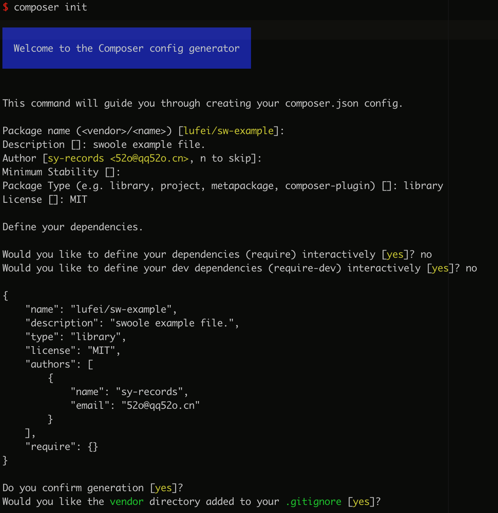

<h1 align="center">创建属于自己的第一个Composer📦</h1>
<p align="right">识沃科技 鲁飞</p>

## 什么是Packagist？
[Packagist](https://packagist.org/)是默认的Composer包存储库，所有包、元数据都是镜像Packagist源站的。

## 如何创建我们的Composer包？

### 1. 命名包名称

命名包名称需要具有唯一性，它应该足够独特，以避免将来发生冲突；

包名是由 **供应商的名称** 和使用 **/** 连接的 **项目名称** 组成；

* `hyperf/hyperf`
* `hyperf/swoole-enterprise`
* `sy-records/swoole-example`

> 包名称不区分大小写，但建议使用短划线 **-** 做为分隔符而不是驼峰`hyperf/SwooleEnterprise`

### 2. 编写composer.json文件

> `composer.json`文件应该放在项目目录的顶级

* 手动创建文件

典型的`composer.json`文件如下所示：
```json
{
    "name": "monolog/monolog",
    "type": "library",
    "description": "Logging for PHP 5.3",
    "keywords": ["log","logging"],
    "homepage": "https://github.com/Seldaek/monolog",
    "license": "MIT",
    "authors": [
        {
            "name": "Jordi Boggiano",
            "email": "j.boggiano@seld.be",
            "homepage": "http://seld.be",
            "role": "Developer"
        }
    ],
    "require": {
        "php": ">=5.3.0"
    },
    "autoload": {
        "psr-0": {
            "Monolog": "src"
        }
    }
}
```

`require`：必须的软件包列表，除非这些依赖被满足，否则不会完成安装。可以限制`php`版本、对应的`ext`扩展，以及需要加载的依赖扩展包等

`autoload`：对应的自动加载映射；`PSR-0`、`PSR-4`、`classmap`、`files`

所有可在`composer.json`中使用的[字段详解](https://docs.phpcomposer.com/04-schema.html)

* 使用命令

```bash
composer init
```



使用命令生成的composer.json文件：

```json
{
    "name": "lufei/sw-example",
    "description": "swoole example file.",
    "type": "library",
    "license": "MIT",
    "authors": [
        {
            "name": "sy-records",
            "email": "52o@qq52o.cn"
        }
    ],
    "require": {}
}
```
### 3. 发布Composer包

将我们写好的代码包提交到[Packagist](https://packagist.org)
